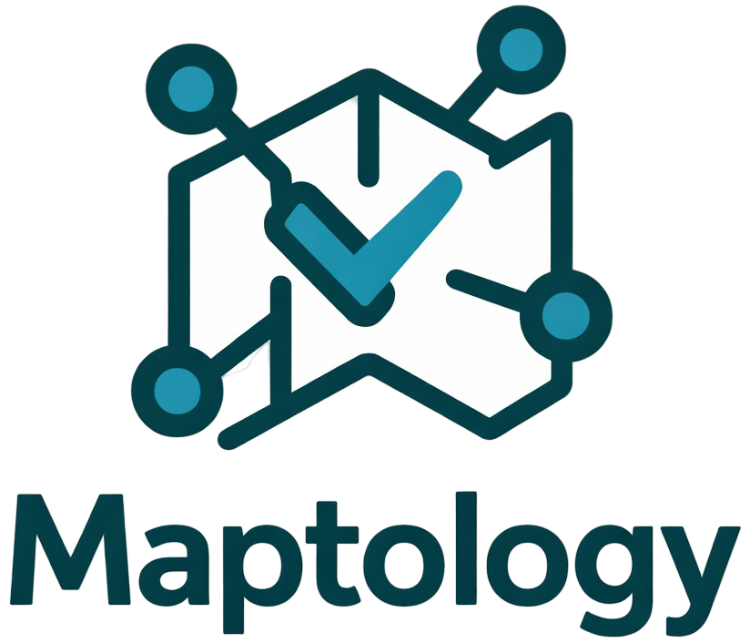

## Why Maptology?

**Maptology** is a Web-based application, written for the Python-based Streamlit framework, that is used to map tabular data files to ontology terms. It addresses a problem in many disciplines in which tabular files typically lack semantic information and thus may be difficult to interpret and reuse. By facilitating the process of mapping column names and categorical data values to ontology terms, Maptology makes data more interoperable and thus more reusable by others.

To illustrate, consider a scenario that our team often faces. We study data from cancer patients, and we often reuse datasets that others have shared in the public domain. In one study, a researcher might store each study participant's biological sex in a column named `Gender` or even something more generic like `characteristic_1`. By examining the data in this column, we can often infer that the values refer to biological sex (which is frequently conflated with gender). Rather than modifying the column name itself, which could cause confusion about [data provenance](https://en.wikipedia.org/wiki/Data_lineage#Data_provenance), we could provide a companion document that indicates the semantic meaning of this column name. For example, we might use the [biological sex](http://purl.obolibrary.org/obo/PATO_0000047) term from the [Experimental Factor Ontology](https://en.wikipedia.org/wiki/Experimental_factor_ontology). Data values in this column might include "F", "M", "female", "male", "non-binary", etc. A human examining these values might be able to infer what they mean based on intuition. However, assigning ontology terms would make the data more explicit and avoid ambiguity. By mapping an ontology term to each unique value, it becomes possible for humans and computers to infer data semantics.

Even if a dataset is *not* being shared with others, mapping the data to ontology terms is valuable because it creates explicit, machine-readable documentation that benefits the original researchers and others on their team. Researchers inevitably revisit datasets months or years later, projects change hands, and analyses are combined across studies. Recording the intended meaning of columns and their values reduces ambiguity, improves reproducibility, and makes it easier to integrate data from multiple sources.

Rather than embedding these annotations directly into a tabular data file, researchers can store them in companion files using community standards such as the [LinkML](https://linkml.io) specification and the [Simple Standard for Sharing Ontological Mappings (SSSOM)](https://mapping-commons.github.io/sssom/dev) specification.

Maptology enables researchers to import tabular data files, choose one or more ontologies, map column names and data values to terms within the selected ontologies, specify the basic data type (e.g., categorical, numeric, date/time), and export this information as LinkML and/or SSSOM files. In doing so, it uses the [TF/IDF methodology](https://en.wikipedia.org/wiki/Tf%E2%80%93idf) to suggest mappings and enables the user to employ their domain expertise to accept or reject suggested mappings and to perform custom searches. These searches are fast, even for large ontologies. No coding is required by the user. Additionally, one feature that Maptology supports is the ability to map multiple ontology terms to the a particular column name or data value. This is important because in many instances, a single ontology term is not descriptive enough on its own.

Although other tools exist for mapping text to ontology terms (e.g., [text2term](https://github.com/rsgoncalves/text2term), [Zooma](https://www.ebi.ac.uk/spot/zooma/), [BioPortal Annotator](https://bioportal.bioontology.org/annotator)), these are designed for free text, while Maptology is designed specifically for tabular files which are ubiquitious in research.

## How it works

#### 1. Upload your data

Upload a data file (supported formats: CSV, TSV, Excel)

#### 2. Map column names

Map your dataset columns to standardized ontology terms.

#### 3. Map data values

Link your data values to official ontology identifiers, labels, and definitions.

#### 4. Review & export

Validate and download the mappings in LinkML and/or SSSOM formats.

## Getting Started

Maptology can be accessed for free by visiting our [demo site](https://bioapps.byu.edu/Maptology). No installation is required other than a Web browser.

Alternatively, Maptology can be run on a local computer. Maptology is available va [PyPi](https://TODO). Versions 3.9+ of Python are supported. To start the app, run `streamlit run main.py`. If that doesn't work, try one of these commands:

  - `python -m streamlit run main.py`
  - `python3 -m streamlit run main.py`
  - `py -m streamlit run main.py`

Another option is to run the app via a Docker container. To do so, TODO.