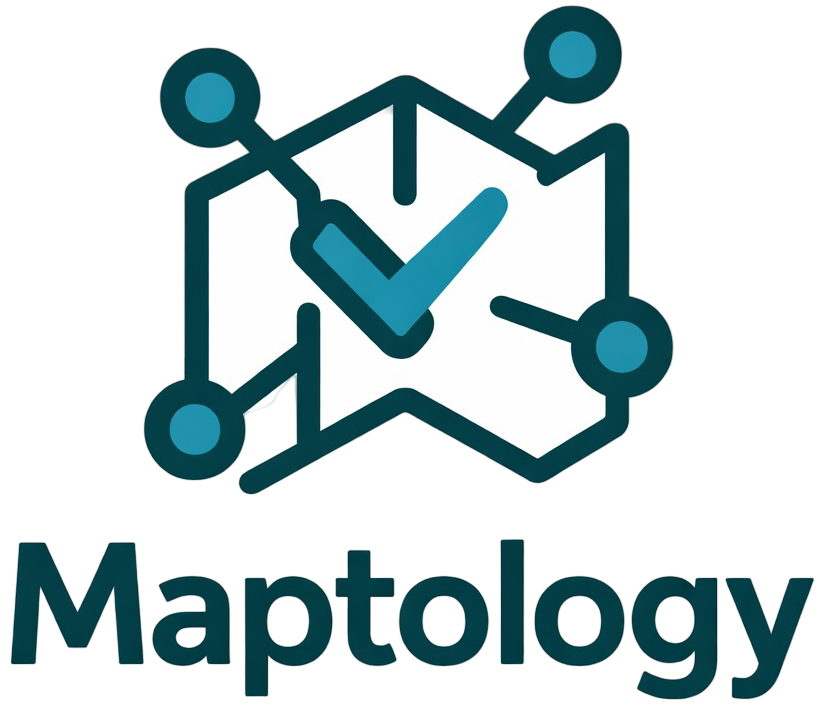

## Why Maptology?

**Maptology** is a Web-based application, written for the Python-based Streamlit framework, that is used to map tabular data files to ontology terms. It addresses a problem in many disciplines in which tabular files typically lack semantic information and thus may be difficult to interpret and reuse. By facilitating the process of mapping column names and categorical data values to ontology terms, Maptology makes data more interoperable and thus more reusable by others.

To illustrate, consider a scenario that our team often faces. We study data from cancer patients, and we often reuse datasets that others have shared in the public domain. In one study, a researcher might store each study participant's biological sex in a column named `Gender` or even something more generic like `characteristic_1`. By examining the data in this column, we can often infer that the values refer to biological sex (which is frequently conflated with gender). Rather than modifying the column name itself, which could cause confusion about [data provenance](https://en.wikipedia.org/wiki/Data_lineage#Data_provenance), we could provide a companion document that indicates the semantic meaning of this column name. For example, we might use the [biological sex](http://purl.obolibrary.org/obo/PATO_0000047) term from the [Experimental Factor Ontology](https://en.wikipedia.org/wiki/Experimental_factor_ontology). Data values in this column might include "F", "M", "female", "male", "non-binary", etc. A human examining these values might be able to infer what they mean based on intuition. However, assigning ontology terms would make the data more explicit and avoid ambiguity. By mapping an ontology term to each unique value, it becomes possible for humans and computers to infer data semantics.

Even if a dataset is *not* being shared with others, mapping the data to ontology terms is valuable because it creates explicit, machine-readable documentation that benefits the original researchers and others on their team. Researchers inevitably revisit datasets months or years later, projects change hands, and analyses are combined across studies. Recording the intended meaning of columns and their values reduces ambiguity, improves reproducibility, and makes it easier to integrate data from multiple sources.

Rather than embedding these annotations directly into a tabular data file, researchers can store them in companion files using community standards such as the [LinkML](https://linkml.io) specification and the [Simple Standard for Sharing Ontological Mappings (SSSOM)](https://mapping-commons.github.io/sssom/dev) specification.

Maptology enables researchers to import tabular data files, choose one or more ontologies, map column names and data values to terms within the selected ontologies, specify the basic data type (e.g., categorical, numeric, date/time), and export this information as LinkML and/or SSSOM files. In doing so, it uses the [TF/IDF methodology](https://en.wikipedia.org/wiki/Tf%E2%80%93idf) to suggest mappings and enables the user to employ their domain expertise to accept or reject suggested mappings and to perform custom searches. These searches are fast, even for large ontologies. No coding is required by the user. Additionally, one feature that Maptology supports is the ability to map multiple ontology terms to the a particular column name or data value. This is important because in many instances, a single ontology term is not descriptive enough on its own.

Although other tools exist for mapping text to ontology terms (e.g., [text2term](https://github.com/rsgoncalves/text2term), [Zooma](https://www.ebi.ac.uk/spot/zooma/), [BioPortal Annotator](https://bioportal.bioontology.org/annotator)), these are designed for free text, while Maptology is designed specifically for tabular files which are ubiquitious in research.

## How it works

#### 1. Upload your data

Upload a data file (supported formats: CSV, TSV, Excel)

#### 2. Map column names

Map your dataset columns to standardized ontology terms.

#### 3. Map data values

Link your data values to official ontology identifiers, labels, and definitions.

#### 4. Review & export

Validate and download the mappings in LinkML and/or SSSOM formats.

## Getting Started

Maptology runs on your own computer. Versions 3.9+ of Python are supported.

```
git clone https://github.com/gy-hwang97/Maptology.git
cd Maptology
pip install -r requirements.txt
```

To start the app, run `streamlit run src/Maptology/main.py`. If that doesn't work, try one of these commands:

  - `python -m streamlit run src/Maptology/main.py`
  - `python3 -m streamlit run src/Maptology/main.py`
  - `py -m streamlit run src/Maptology/main.py`

### Before the first run: a BioPortal API key

Maptology searches ontologies locally, which is what makes it fast, but those
local search indexes have to be built from the ontologies themselves first.
Maptology downloads them from [BioPortal](https://bioportal.bioontology.org),
which requires a free API key.

1. Create a free account at
   [bioportal.bioontology.org/accounts](https://bioportal.bioontology.org/accounts)
   and copy your API key.
2. Make it available to Maptology, either as an environment variable:

   ```
   # macOS / Linux
   export BIOPORTAL_APIKEY=your-key-here
   # Windows PowerShell
   $env:BIOPORTAL_APIKEY = "your-key-here"
   ```

   or by entering it when Maptology asks on the first run.

Your key stays on your computer. Maptology does not send it anywhere except to
BioPortal, and it is only used to download and update ontologies — not while you
are searching or mapping.

### How ontologies are downloaded

**By default, Maptology uses lazy loading.** The app opens immediately, and an
ontology is downloaded from BioPortal and indexed the first time you select it
in the app — a few seconds for most ontologies, a couple of minutes for the
largest (NCIT, CHEBI, PR and GAZ are around 1 GB each). Most people map against
five or ten ontologies, so nothing else is fetched. Once an ontology is on your
machine, searching it is local and needs no network connection.

Ontologies you already have are checked against BioPortal for new versions at
most once every 30 days; when a newer version exists, it is fetched the next
time you select that ontology.

**To download everything up front instead**, set an environment variable before
starting the app:

```
# Windows PowerShell
$env:MAPTOLOGY_DOWNLOAD_ALL = "yes"
# macOS / Linux
export MAPTOLOGY_DOWNLOAD_ALL=yes
```

This suits a server installation, where nobody is waiting at the terminal.
What it costs, measured once from a clean machine:

| | |
|---|---|
| Ontologies | ~1,000 |
| Downloaded | **~15 GB** of ontology files |
| Search indexes built from them | **~1.6 GB** |
| Time spent downloading | **~30 minutes** |
| Time spent building indexes | **~75 minutes** |

The two phases overlap — indexing starts on each ontology as soon as its file
lands — so the run does not cost the sum of those two figures. It costs roughly
the longer of them, which makes indexing the part that decides how long you
wait. Every run writes its spans to `run_log.jsonl` next to the ontology
files, so the wall clock for your own machine comes from the log rather than
from adding the phases up.

Two things are worth knowing before you start it.

**A faster internet connection may not help much.** A single connection to
BioPortal moved about 4.7 MB/s whatever the file size when we measured it, so
Maptology downloads several at once (12.4 MB/s over four connections, 15.4 MB/s
over eight). These are figures from one machine on one network in South Korea;
we have not established where the ceiling comes from, and it could be
BioPortal, the path, or this end. Treat them as what to expect here, not as a
property of BioPortal.

**Building the indexes takes longer than downloading them** — about two and a
half times as long in our measurements. The cost comes from the number of
ontologies rather than their size, because each one carries a fixed start-up
cost; the handful of very large ones are only a couple of minutes apiece.

Progress is printed in the terminal, and the app opens once processing has
finished. You can stop it at any point; Maptology runs with whatever it has
already built and fetches the rest lazily. Later starts only fetch what
changed. A few ontologies are published in formats Maptology cannot read; those
are recorded and skipped rather than retried on every start.

Requests are spaced out to stay within BioPortal's published rate limit of 15
requests per second.

If you would rather not download everything, you can stop the process and
Maptology will use whatever it has already built.